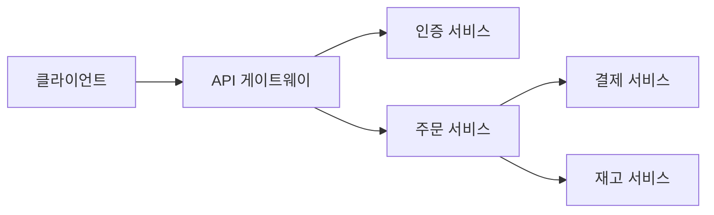

주로 동작원리와 최적화에 대한 자료들


## second brain
second brain 이라고 부르는 claude 의 MEMORY.md 파일 관련된 기능은 gemini 에서 완벽하게 지원되지는 않는다. 여기에 대해 검색해본 내용은 다음과 같다.<br/>

- Gemini 역시 `/memory` 명령어와 `GEMINI.md`를 통해 유사한 기능을 제공합니다.
- **`GEMINI.md`**: Claude의 `CLAUDE.md`와 `MEMORY.md` 역할을 통합 수행하며, 글로벌(`~/.gemini/`)과 로컬(프로젝트 루트) 설정을 지원합니다.
- **자동 학습 (`save_memory`)**: 모델이 대화 중 배운 내용을 `GEMINI.md` 내에 `## Gemini Added Memories` 섹션으로 자동 기록하여 이후 세션에서 재활용합니다.
- **주요 명령어**:
    * `/memory add` : 새로운 지식 수동 추가
    * `/memory show` : 현재 로드된 메모리 확인
    * `/memory refresh` : `GEMINI.md` 변경사항 즉시 반영

<br/>

결론은, gemini 에서는 claude 에서의 MEMORY.md 파일 등으로 세컨드 브레인을 제공하는 기능은 지원되지 않으며 CLI 로 추가는 할수 있기는 하지만 이런 방식은 사용자들은 별로 선호하지 않는다는 것이다. 따라서 GEMINI.md 파일이 비대해지지 않도록 각 참조할 문서들의 위치를 reference 로 추가하는 방법이 가장 좋아 보인다. Gemini CLI 팀에서 Claude 를 쓰고 있고 Gemini CLI 개발시 이 기능들을 Gemini CLI 에서도 지원할지를 충분히 고민했을 것 같다는 생각이 든다. 아마도 MEMORY.md 는 그냥 Reference doc 들의 위치를 명시하는 것으로 대체했겠구나 하고 생각했다.<br/>
<br/>


### GEMINI 세션 시작 시 마다 CLAUDE.md, MEMORY.md 자동 로드 여부
claude 에서는 개인 메모리는 MEMORY.md, 팀 공유 지식 등은 CLAUDE.md 를 제공하며, claude 세션  시작 시마다 MEMORY.md, CLAUDE.md 가 로드 된다. 따라서 클로드가 이전 세션에서 배운 것을 재활용 가능하다.<br/>

하지만 Gemini 는 자동으로 로드하지 않는다. 따라서 CLAUDE.md 와 MEMORY.md 의 내용을 모두 복사해서 GEMINI.md 에 붙여넣어야 한다.<br/>
다음은 이 내용에 대한 gemini 의 답변이다.<br/>

Gemini CLI는 기본적으로 **`MEMORY.md`나 `CLAUDE.md`를 인식하지 않습니다.** 

Gemini CLI는 오직 **`GEMINI.md`** 파일만을 자동 로드(Auto-load) 대상으로 사용합니다. 따라서 Claude에서 사용하던 설정과 메모리를 Gemini에서도 그대로 적용하고 싶다면, 해당 파일들의 내용을 **`GEMINI.md`로 통합하거나 이름을 변경**해야 합니다.

### 상세 비교 및 파일 통합 안내

| 항목 | Claude Code (자동 로드) | **Gemini CLI (자동 로드)** |
| :--- | :--- | :--- |
| **핵심 규칙/지침** | `CLAUDE.md` | **`GEMINI.md`** |
| **활동/학습 메모리** | `MEMORY.md` | **`GEMINI.md`** (내부 섹션으로 통합) |
| **위치** | `./.claude/` | **`./` (루트) 또는 `~/.gemini/`** |

### 요약 답변
1.  **자동 로드 여부**: **아니오.** `MEMORY.md`와 `CLAUDE.md`는 자동으로 로드되지 않습니다.
2.  **해결 방법**:
    *   Claude의 `CLAUDE.md`(팀 지침)와 `MEMORY.md`(개인 메모리) 내용을 모두 복사하여 **`GEMINI.md`** 파일 하나에 붙여넣으세요.
    *   그러면 Gemini CLI를 실행할 때마다 해당 내용을 완벽하게 인식하고 작업을 시작합니다.

작성 중이신 문서에 이 '파일 호환성 및 통합'에 대한 주의 사항을 추가해 두면, 이후에 Claude에서 Gemini로 넘어오는 사용자들이 실수하지 않도록 가이드할 수 있을 것 같습니다. 추가로 문서 업데이트가 필요하시면 바로 말씀해 주세요.


### claude 와 비교
claude 의 /memory
- 자동 메모리 관리 기능
- .claude/projects/{project}/memory/MEMORY.md
- claude 세션 시작 시마다 MEMORY.md 가 자동으로 로드 되기에 클로드가 이전 세션에서 배운 것을 재활용 가능
- 개인 메모리는 MEMORY.md
- 팀 공유 지식 등은 CLAUDE.md

<br/>


## Lazy Loading (지연 로딩 전략)
- **핵심 아이템**: "지침 파일(`GEMINI.md`)을 어떻게 가볍게 유지할 것인가?"
- **흔한 실수**: API 스펙, DB 스키마, 아키텍처 등 모든 상세 내용을 `GEMINI.md` 하나에 몰아넣는 경우.
    - 매 세션마다 이 모든 내용을 읽어야 하므로 토큰이 낭비되고 모델의 추론 속도가 저하됩니다.
- **해결책 (Lazy Loading)**: `GEMINI.md`에는 **참조(Reference) 경로**만 명시하고, 모델이 필요할 때만 파일을 읽게 합니다.

### [Best Practice] GEMINI.md 작성 예시
```markdown
# GEMINI.md
## Reference Docs
프로젝트의 상세 정보는 아래 문서를 참고하여 필요 시 읽어올 것:
- API 스펙: `docs/api-spec.md`
- DB 스키마: `docs/db-schema.md`
- 컨벤션: `docs/conventions.md`
```
> **동작 예시**  
> 사용자: "새로운 API 엔드포인트 추가해줘"  
> Gemini: (메모리에서 `docs/api-spec.md` 경로를 확인 후) `read_file("docs/api-spec.md")`를 실행하여 스펙을 확인한 뒤 작업 수행

### [Optimization] 계층형 GEMINI.md 활용
루트의 `GEMINI.md`가 비대해지는 것을 방지하기 위해 폴더별로 지침을 분리합니다.
- **경로 예시**: 
    - `src/auth/GEMINI.md` (인증 관련 특화 지침)
    - `src/payments/GEMINI.md` (결제 처리 특화 지침)
- **효과**: Gemini는 사용자가 특정 폴더 내에서 작업할 때만 해당 위치의 `GEMINI.md`를 로드하므로, 전체 컨텍스트가 불필요하게 커지는 것을 막아줍니다.

---

### Claude 와의 비교 (Lazy Loading)
| 항목 | Claude Code | **Gemini CLI** |
| :--- | :--- | :--- |
| **참조 파일 명칭** | `CLAUDE.md` | **`GEMINI.md`** |
| **자동 로드 방식** | 세션 시작 시 자동 로드 | 세션 시작 시 자동 로드 |
| **계층형 지원** | `.claude/CLAUDE.md` 폴더별 가능 | **폴더별 `GEMINI.md`** 가능 |
| **권장 사항** | `@경로` 형태 사용 권장 | **파일 경로 명시** (모델이 필요 시 읽음) |


## 컨텍스트 윈도우 관리 — 한 세션 = 한 피처
- **상태 비교**: Claude의 컨텍스트 윈도우는 약 200K인 반면, **Gemini(1.5 Pro)는 최대 2M 토큰**을 지원합니다.
    - Gemini의 용량이 훨씬 크지만, 컨텍스트가 비대해지면 모델의 응답 속도가 느려지고 비용(토큰 사용량)이 증가하며, 아주 가끔 관련 없는 이전 대화 내용이 현재 작업에 간섭할 수 있습니다.
- **핵심 명령어**: Gemini CLI에서도 **`/clear`** (대화 완전 초기화)와 **`/compact`** (맥락 요약/압축) 명령어가 핵심입니다.
- **가장 현실적인 관리 방식**: **'한 세션 = 한 피처'** 원칙을 고수하는 것입니다.
    - "한 세션에서는 오직 한 작업만 완료한다"는 생각으로 접근하세요. 여러 기능을 연달아 구현하지 않는 것이 훨씬 정확합니다.
    - 예: 로그인 API 구현 완료 -> **`/clear`** -> 새로운 마음으로 결제 기능 시작.
-  e.g. 결제 기능 전체를 만들어줘 (x) -> stripe webhook handler 만들어줘 (o)

### 실전 워크플로우 (Gemini 추천)
1.  **Plan Mode**: 전체 작업 단위를 설계하고 단계를 나눕니다.
2.  **`/clear`**: 설계를 마쳤다면 컨텍스트를 비우고 '구현'에만 집중할 수 있는 새 세션을 시작합니다.
3.  **단계별 구현**: 가장 세밀한 단위(예: "Stripe Webhook 핸들러 생성") 하나만 먼저 수행합니다.
4.  **완료 후 초기화**: 해당 단계가 끝나면 다시 `/clear`를 하여 "신선한 컨텍스트"를 유지한 채 다음 단계로 넘어갑니다.

> **핵심 원칙**: "Gemini의 통은 크지만, 깨끗한 통(Fresh Context)이 결과물의 품질을 보장합니다."


## MCP 토큰 모니터링 — 안 쓰는 MCP 비활성화
- **토큰 낭비 방지**: Notion, Linear와 같이 도구가 많은 MCP는 설명(Tool Definition)만으로 수천 개의 토큰을 소모합니다. 
- **관리 명령어**: Gemini CLI에서도 **`/mcp`** 명령어를 통해 현재 활성화된 서버들을 관리할 수 있습니다. 사용하지 않는 서버는 즉시 비활성화(Disable) 하세요.
- **최적화 팁**: 꼭 필요한 기능만 선별하여 커스텀 MCP로 래핑하여 사용하면, 토큰 절약은 물론 모델이 어떤 도구를 써야 할지 더 명확하게 판단하게 되어 응답 품질이 향상됩니다.

## GEMINI.md (또는 참조 문서)에 Mermaid 아키텍처 정리하기

- **시각적 컨텍스트 제공**: `GEMINI.md`에 **Mermaid 다이어그램**을 포함하면 모델이 단순 텍스트보다 프로젝트의 구조와 데이터 흐름을 훨씬 직관적으로 파악합니다.
- **관리 포인트**:
    - 아키텍처가 단순하다면 `GEMINI.md` 상단에 직접 명시합니다.
    - 복잡한 아키텍처는 **Lazy Loading** 원칙에 따라 `docs/architecture.md`에 작성하고, `GEMINI.md`의 `## Reference Docs` 섹션에 경로를 기재하여 필요할 때만 읽도록 유도합니다.

---

### Claude 와의 비교 (도구 및 아키텍처)
| 항목 | Claude Code | **Gemini CLI** |
| :--- | :--- | :--- |
| **MCP 관리** | `/mcp` (서버 목록/관리) | **`/mcp` (동일하게 지원)** |
| **기본 설명 파일** | `CLAUDE.md` | **`GEMINI.md`** |
| **다이어그램 지원** | Mermaid 이해도 높음 | **Mermaid 이해도 매우 높음** |
| **최적화 핵심** | 도구 최소화 및 파일 분리 | **도구 최소화 및 파일 분리 (동일)** |


## 무거운 작업은 스크립트로 오프로드
- **컨텍스트 오염 방지**: 대규모 데이터 파싱, 전처리 등 무거운 작업을 대화 내에서 직접 수행하면 출력이 너무 길어지고 컨텍스트가 오염됩니다.
- **전략**: Gemini에게 직접 결과를 내놓으라고 하지 말고, **스크립트를 작성하여 로컬에서 실행**하게 한 뒤 결과 파일(`summary.json` 등)만 보고받으세요.
    - 예: "10만 행 CSV를 파싱해서 무결성을 검증하는 파이썬 스크립트를 짜서 실행해줘. 결과는 파일로 저장하고 요약만 해줘."

## 워크플로우 & 코딩 철학 — Plan Mode 가 우선
- **권장 사항**: 모든 작업은 반드시 **Plan Mode**에서 시작하는 것을 추천합니다. (`Shift + Tab`으로 승인 모드 전환)
- **순서**: 작업 설명 -> Gemini의 계획 제시 -> 사용자의 리뷰 및 피드백 -> 실행(Accept).
- **효과**: 플랜 없이 시작하면 모델이 프로젝트 구조를 오해하여 엉뚱하게 코드를 수정하거나 불필요한 토큰(Usage)을 낭비하는 대참사를 막을 수 있습니다.

## TDD 기반 스마트 코딩 — 작은 변경 → 테스트 → 커밋
- **원칙**: 작은 기능 변경이라도 그냥 넘어가지 말고 반드시 테스트 코드를 실행하여 검증한 뒤 다음 단계로 넘어가세요.
- **장점**: 테스트 성공 후 즉시 커밋하는 습관을 들이면, AI가 실수를 했을 때 원복하기가 매우 쉽고 검증 작업이 단순해집니다.

## Thinking 로그 읽기 — 잘못된 가정은 Escape로 즉시 중단
- **모니터링**: Gemini가 응답을 생성하는 동안 출력되는 **Thinking(추론) 로그**를 유심히 살피세요.
- **즉시 중단**: AI가 잘못된 경로를 참조하거나 엉뚱한 방향으로 가정을 시작한다면, 즉시 **`ESC`**를 눌러 중단하고 지침을 수정한 뒤 다시 시도하세요.

## 다른 AI에게 비평 받기 — 내보내기 명령 활용
- **전략**: 진행 중인 채팅 내용을 내보내어 ChatGPT나 Claude에게 교차 검토(Cross-check)를 받으세요.
- **명령어**: Gemini CLI에서는 **`/resume share`** (또는 `/chat share`) 명령어를 사용하여 대화 내역을 Markdown 형식 등으로 내보낼 수 있습니다.


## 에러 로그 그대로 붙여넣기
- **원칙**: 에러를 사용자가 해석해서 설명하지 마세요.
- **팁**: 터미널에 발생한 에러 로그(Stack Trace)를 **통째로 복사해서 Gemini에게 던지세요.**
- **효과**: Gemini는 원본 로그에서 문맥을 직접 파악하여 훨씬 정확한 해결책을 제시합니다.

## TODO.md로 작업 연속성 유지
- **흐름**: 하루 시작(할일 정리) -> `TODO.md`에 체크리스트 작성 -> Gemini에게 순차 처리 지시 -> 세션 종료 시 `TODO.md` 업데이트.
- **장점**: 로컬 `TODO.md`를 활용하면 세션이 끊기거나 새로 시작하더라도 작업의 흐름을 완벽하게 이어갈 수 있습니다.

---

## WAT 프레임워크 — 복잡한 프로젝트를 지탱하는 3요소
"AI의 추론과 코드 실행을 전략적으로 분리하라."

### 1. W (Workflows): 작업 흐름을 글로 정의
- **방법**: 작업을 시작하기 전, 단계를 명확히 정의합니다.
- **예시**: 
    1. DB 스키마에 컬럼 추가 
    2. UI 컴포넌트 구현 
    3. 알림 발송 로직 작성 
    4. 테스트 실행 및 검증
- **효과**: Gemini가 방향을 잃는 대부분의 경우는 Workflow 정의를 건너뛰었을 때 발생합니다.

### 2. A (Agents): Self-Healing & 에이전틱 보정
- **Self-healing**: 에러 발생 -> 로그 자동 읽기 -> 원인 파악 -> 코드 수정 -> 재실행 프로세스를 Gemini가 스스로 수행하도록 지시하세요.
- **서브 에이전트 활용**: 복잡한 작업은 메인 Gemini(코디네이터)가 전체를 총괄하고, 각각의 원자적 도구들을 활용해 단계를 해결해 나가는 방식으로 구성합니다.

### 3. T (Tools): 원자적 도구 조합
- **거대한 스크립트 지양**: 200줄짜리 거대한 `deploy-all.sh`는 관리가 어렵고 AI가 실수할 확률이 높습니다.
- **원자적 도구 지향**: `build.sh`, `test.sh`, `migrate.sh` 등 **작고 명확한 도구**들을 조합하여 사용하도록 유도하세요. 도구가 작을수록 응답 품질과 안정성이 올라갑니다.


## WAT 종합 예시 — 블로그 댓글 기능을 WAT로 풀어보기 (Gemini Ver.)

### **W: Workflows (작업 흐름 정의)**
사용자 프롬프트 (가장 세밀한 단계로 지시)
```markdown
블로그에 댓글 기능을 추가해줘. 
다음 순서로 진행하되, 한 단계가 끝나면 반드시 결과를 보고하고 내 승인을 받아:

1. comments 테이블 스키마 설계 및 마이그레이션 파일 생성
2. 댓글 CRUD API 엔드포인트 구현 (유효성 검사 포함)
3. 프론트엔드 댓글 컴포넌트 구현 (React)
4. 각 단계마다 유닛 테스트 작성 및 통과 여부 확인
```

### **A: Agents (에이전틱 보정)**
**Gemini (메인 코디네이터)**
- **DB 태스크**: 테이블 설계, FK 설정 및 인덱스 최적화 수행.
- **API 태스크**: 유효성 검사 로직 및 RESTful 에러 핸들링 구현.
- **QA 태스크**: 테스트 케이스 설계 및 단위/통합 테스트 실행을 통한 검증.
- *참고: Gemini는 하나의 세션에서 여러 도구를 활용해 위 역할들을 유연하게 수행합니다.*

### **T: Tools (도구 조합 및 자동화)**
- **Scripts (원자적 실행)**
  - 예: `sh scripts/migrate.sh --up` (DB 반영)
  - 예: `sh scripts/validate-schema.sh` (스키마 무결성 체크)
- **MCP Server (GitHub 자동화)**
  - **GitHub MCP**를 활용해 작업 완료 후 **브랜치 생성 및 Pull Request(PR)**를 자동으로 올리고 리뷰어를 지정합니다.
- **Rules (`GEMINI.md` 기반 자동화)**
  - 커밋 또는 작업 마무리 단계에서 아래와 같은 검증 지침을 `GEMINI.md`에 정의하여 활용합니다.
  ```markdown
  ### ✅ 작업 완료 전 체크리스트
  - [ ] `npm run lint` & `npm run typecheck` 통과 확인
  - [ ] 기능 관련 유닛 테스트(`npm test`) 통과 확인
  ```

<br/>


## Questions
### Q1. Sub Agent 지원 여부
Gemini CLI 에서 Claude Code 의 Sub Agent 비슷한 기능이 지원되는지? 비슷한 기능이 있다면 어떤 개념인지 설명하고 예제를 보여주세요. 

바로 아래의 #### A 에 답변을 작성하세요. 질문 내용은 삭제하거나 수정하지 마세요.

#### A
Gemini CLI는 Claude Code와 같은 명시적인 `Sub Agent` 명령어를 별도로 두기보다는, **'에이전틱 도구 호출(Agentic Tool-Use)'**과 **'MCP(Model Context Protocol) 서버'**를 통해 동일한 기능을 구현합니다.

### 1. 핵심 개념: 도구가 곧 서브 에이전트
Claude가 별도의 에이전트 인스턴스를 생성한다면, Gemini는 각 태크스에 특화된 **MCP 도구들을 서브 에이전트처럼 오케스트레이션(Orchestration)** 합니다. 예를 들어, 코드를 작성하는 Gemini(메인)가 파일 시스템 도구, GitHub MCP, 브라우저 도구 등을 각각의 전문 하위 요원으로 부리는 방식입니다.

### 2. 예제: 블로그 댓글 기능 구현 시나리오
Gemini CLI에서 복잡한 작업을 지시하면 내부적으로 다음과 같이 전문화된 도구(서브 에이전트 역할)를 호출합니다.

```markdown
사용자 요청: "GitHub에 브랜치를 만들고 댓글 기능을 구현한 뒤 PR까지 올려줘."

Gemini의 에이전틱 흐름 (Sub Agent 역할 수행):
1. [Git Sub-Agent 역할]: `github_mcp` 도구를 호출하여 새 브랜치 `feature/comments` 생성
2. [Code Sub-Agent 역할]: `write_to_file` 도구를 사용하여 스키마 및 API 로직 구현
3. [Test Sub-Agent 역할]: `run_command` 도구로 `npm test`를 실행하여 직접 검증
4. [Review Sub-Agent 역할]: 다시 `github_mcp`를 호출하여 구현된 내용을 바탕으로 PR 생성 및 요약 작성
```

### 요약
- **개념**: **지능형 도구 위임(Delegation to Tools)**.
- **차이점**: Claude는 '에이전트 인스턴스' 중심의 분리라면, Gemini는 '도구(MCP) 중심의 전문화'를 통해 컨텍스트를 유지하면서 멀티태스킹을 수행합니다. 
- **장점**: 모든 기록이 하나의 세션 내에서 도구 호출 로그로 남기 때문에, 메인 에이전트가 하위 작업의 결과를 훨씬 더 정확하게 추론 과정에 반영할 수 있습니다.


### Q2.
Q1 은 결론만 놓고 보면 서브에이전트가 Gemini CLI 에는 없다는 얘기죠? 대신 MCP 도구를 사용해라는 이야기죠?

바로 아래의 #### A 에 답변을 작성하세요. 질문 내용은 삭제하거나 수정하지 마세요.

#### A
네, 맞습니다. 기술적인 구조로만 보면 Claude Code처럼 별도의 독립된 '서브 에이전트 인스턴스'를 생성하는 기능은 명시적으로 존재하지 않습니다. 대신, **Gemini CLI는 모든 도구(특히 MCP 서버를 통한 도구들)를 하위 전문 요원(Sub-Agent)으로 취급**하는 방식을 택하고 있습니다.

따라서 사용자는 "서브 에이전트를 만들어라"라고 지시하는 대신, 다음과 같은 방식으로 작업하게 됩니다:
1.  **MCP 도구 활용**: GitHub, Slack, Browser 등 특정 환경에 특화된 MCP 도구들을 연결해 둡니다.
2.  **자동 오케스트레이션**: Gemini가 복잡한 작업을 분석하여, 각 단계마다 필요한 도구를 스스로 호출합니다. 이때 모델은 해당 도구를 "도구"라고 부르지만, 실제로는 전문적인 서브 에이전트에게 업무를 위임하는 것과 동일한 효과를 냅니다.
3.  **브라우저 서브 에이전트**: 특히 브라우저 조작이 필요한 경우, `browser_subagent`라는 도구가 내부적으로 실행되어 마치 별도의 요원이 브라우저를 다루는 것처럼 동작합니다.

**요약하자면:**
- **구조적 차이**: Claude는 '에이전트'라는 객체를 복제/생성하는 방식이고, Gemini는 '강력한 도구(MCP)'에게 권한을 위임하는 방식입니다.
- **실전 팁**: Gemini CLI를 쓸 때는 "어떤 서브 에이전트가 필요할까?"를 고민하기보다, **"어떤 MCP 도구를 활성화해둘까?"**를 고민하는 것이 더 효율적인 접근법입니다.
