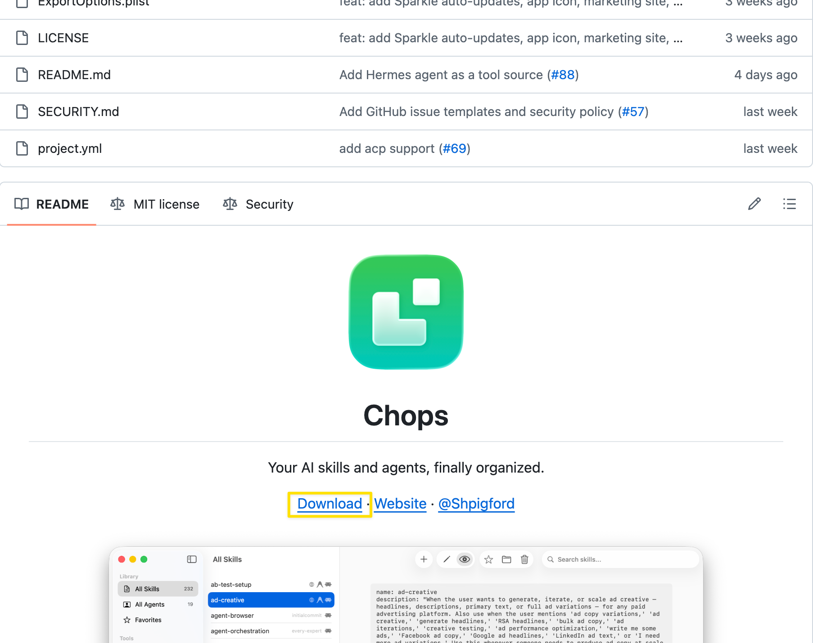
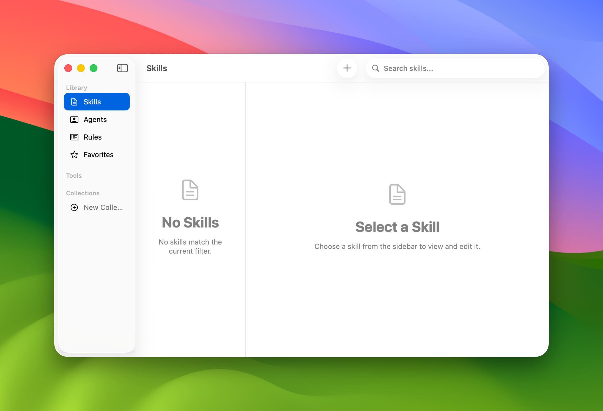

skill 의 내용이 많이 생기면 일일이 하나씩 열어서 확인하기 어려워지는데, GUI 에서 skill 을 탐색할수 있는 프로그램이 chops 다.

 

구글에서 'github chops' 를 검색하면 다음 주소를 찾을 수 있다.
- https://github.com/Shpigford/chops

 

Download 버튼 클릭하면 다운로드 된다. 다운로드 받은 후 dmg 파일을 실행해서 설치를 하면 된다.

 

실행해보면 다음과 같이 탐색기와 함께 Agent, Skill 등을 GUI 로 탐색할수 있는 프로그램이 나타난다.

