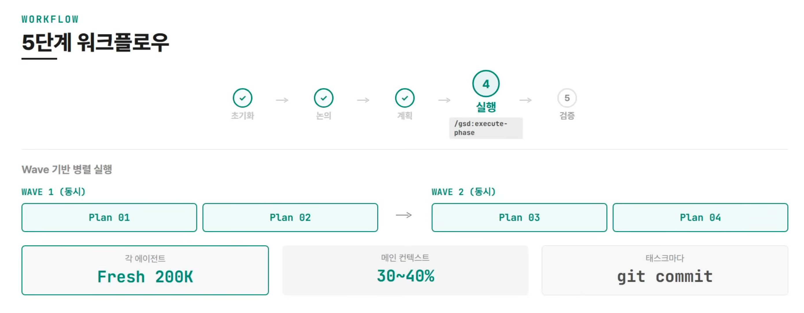

## 참고자료
https://www.youtube.com/watch?v=oU-BbX0Om4I

## workflow
- 초기화 : `/gsd:new-project` : gsd 가 질문을 하는 단계
- 논의 : `/gsd:discuss-phase` : 모호한 부분을 구체화 
- 계획 : `/gsd:plan-phase` : 계획 수립(계획 -> XML형식의 계획서 생성 -> 자체 검증 수행)
- 실행 : `/gsd:execute-phase` : 계획서를 바탕으로 코드 생성
- 검증 : `/gsd:verify-phase` : 생성된 코드 검증

## 초기화 (`/gsd:new-project`)
gsd 가 질문을 하는 단계
- 뭘 만들거야?
- 기술스택은?
- 제약조건은?
- 엣지 케이스는?

 

## 논의 (`/gsd:discuss-phase`)
모호한 부분을 구체화
- 카드형 vs 테이블형
- 토스트 vs 인라인

 

## 계획 (`/gsd:plan-phase`)
계획을 하는 단계
- 리서치 수행 -> XML 형식의 계획서 생성 -> 자체 검증 수행
- 자체 검증까지 수행

 

## 실행 (`/gsd:execute-phase`)
계획서를 바탕으로 코드 생성
- 'wave' 라는 작업단위로 작업들을 수행
- 각 작업 마다 git commit 을 수행
- 문제가 생기면 어느 태스크에서 생겼는지 git bisect 로 찾는다.

 

## 검증 (`/gsd:verify-phase`)
생성된 코드 자동 검증 (자동+수동 검증)
- 코드 존재 확인
- 테스트 통과 확인
- 사용자 수동 확인

문제 발생 시 : 디버그 에이전트 분석 -> 수정 계획서 생성 -> 재실행

 
