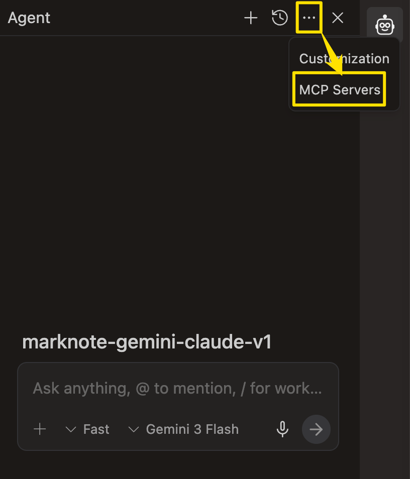
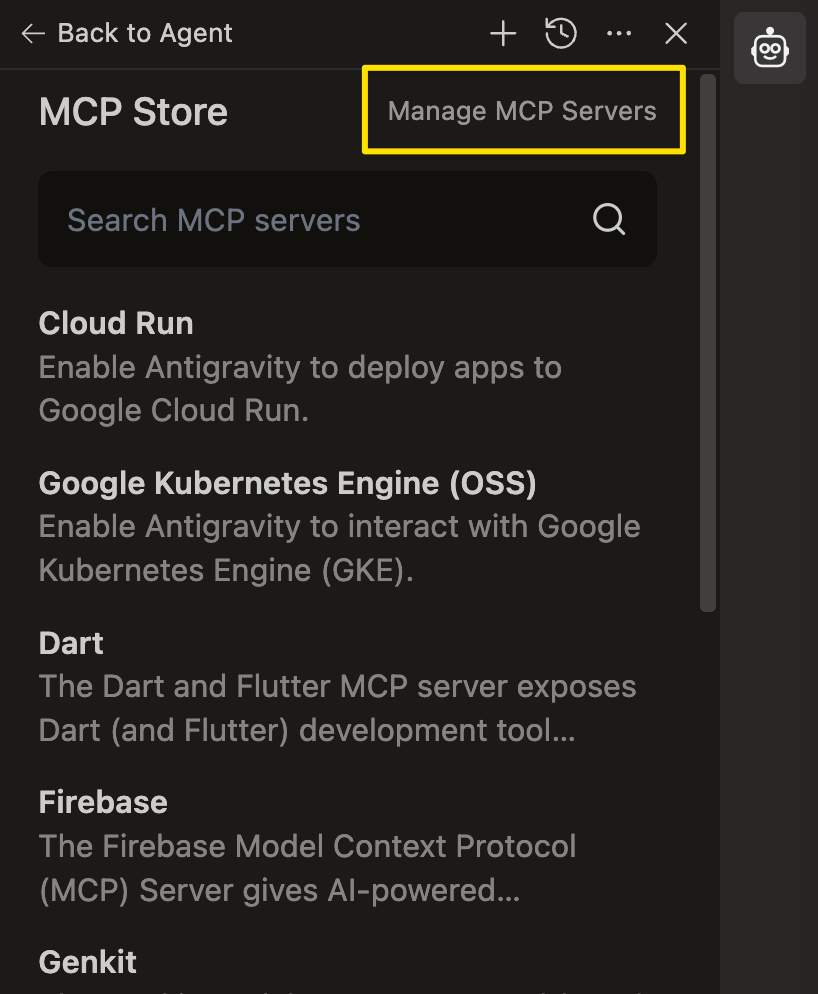
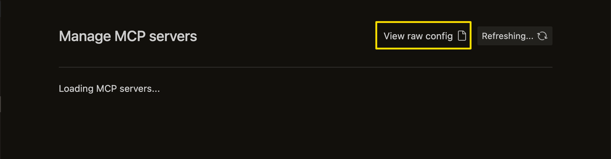
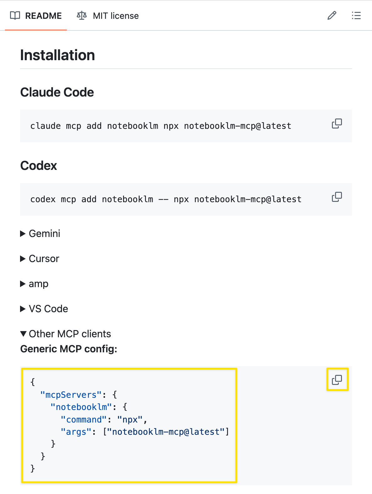

# Antigravity + NotebookLM 연동 가이드: (1) MCP Server 방식

이 문서는 MCP Server를 활용하여 NotebookLM을 Antigravity에 연동하는 방법을 설명합니다.

> [!NOTE]
> 해당 방식은 토큰 소모 및 API 과금 발생 가능성이 있습니다. 비용 효율적인 방식을 선호하신다면 **Way 2 (Gemini CLI Skill 방식)**를 권장합니다.

---

## 📋 사전 준비 사항
- `npx`가 시스템 `PATH`에 지정되어 있어야 합니다. (터미널에서 `npx` 명령어가 실행 가능해야 함)

## 🔗 참고 자료
- [유튜브] [안티그래비티 + 노트북 LM으로 만드는 서브 에이전트](https://www.youtube.com/watch?v=IMFiasVnc0o)

---

## ⚙️ Antigravity에 MCP Server 추가 절차

### 1단계: MCP Servers 진입
Antigravity 인터페이스에서 **mcp servers** 아이콘을 선택합니다.


### 2단계: 서버 관리 설정
현재 NotebookLM은 공식 지원 목록에 없으므로, 하단의 **Manage MCP Servers**를 선택합니다.


### 3단계: 설정 파일 수정
로딩이 완료되면 **View raw config** 버튼을 클릭하여 설정 파일을 엽니다.


### 4단계: 서버 정보 입력
설정 파일에 다음의 JSON 내용을 추가합니다.
```json
{
  "mcpServers": {
    "notebooklm": {
      "command": "npx",
      "args": ["notebooklm-mcp@latest"]
    }
  }
}
```

### 5단계: 목록 갱신
설정 저장 후 **Manage MCP** 창으로 돌아가 **Refresh** 버튼을 클릭하면 `notebooklm` 서버가 목록에 나타납니다.

---

## 🔍 MCP 서버 정보(주소 및 인자값) 찾는 방법

필요한 커맨드나 인자값은 다음의 과정을 통해 최신 정보를 확인할 수 있습니다.

1.  구글에서 **'notebooklm mcp'** 검색
2.  검색 결과 중 [PleasePrompto/notebooklm-mcp GitHub](https://github.com/PleasePrompto/notebooklm-mcp) 저장소 선택
3.  GitHub의 `README.md` 내용 중 **Other MCP clients** 섹션을 찾아 해당 설정값을 복사
    
