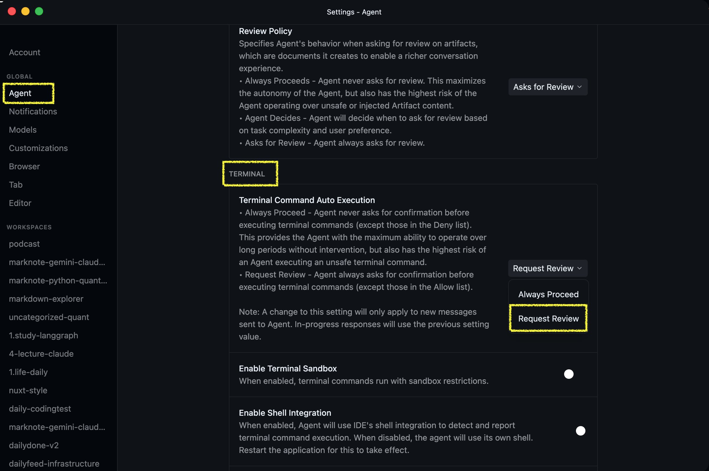

# 💡 Antigravity 소소한 팁

## 🖥️ 터미널 명령어 실행 권한 설정

명령어 실행 시 매번 승인을 요청하는 팝업이 번거롭다면, 작업의 신뢰도에 따라 터미널 실행 옵션을 조정하여 생산성을 높일 수 있습니다.

### 1. 자동 승인 설정 (`Always Proceed`)
자주 반복되는 안전한 작업이나 매번 승인 버튼을 누르는 것이 번거로운 경우 사용합니다. 이 옵션을 선택하면 Antigravity가 사용자에게 확인하지 않고 명령어를 즉시 처리합니다.

> [!TIP]
> 단순 빌드, 파일 조회 등 반복적이고 안전한 작업을 수행할 때 유용합니다.

### 2. 수동 승인 설정 (`Request Review`)
중요한 파일 삭제, 외부 요청, 혹은 시스템 설정을 변경하는 등의 주의가 필요한 작업을 수행할 때는 다시 승인 확인 절차를 활성화하는 것이 안전합니다.

> [!IMPORTANT]
> 프로젝트의 소스 코드를 대량으로 수정하거나 파괴적인 명령어를 실행할 가능성이 있는 경우에는 반드시 `Request Review` 상태를 유지하는 것을 권장합니다.
