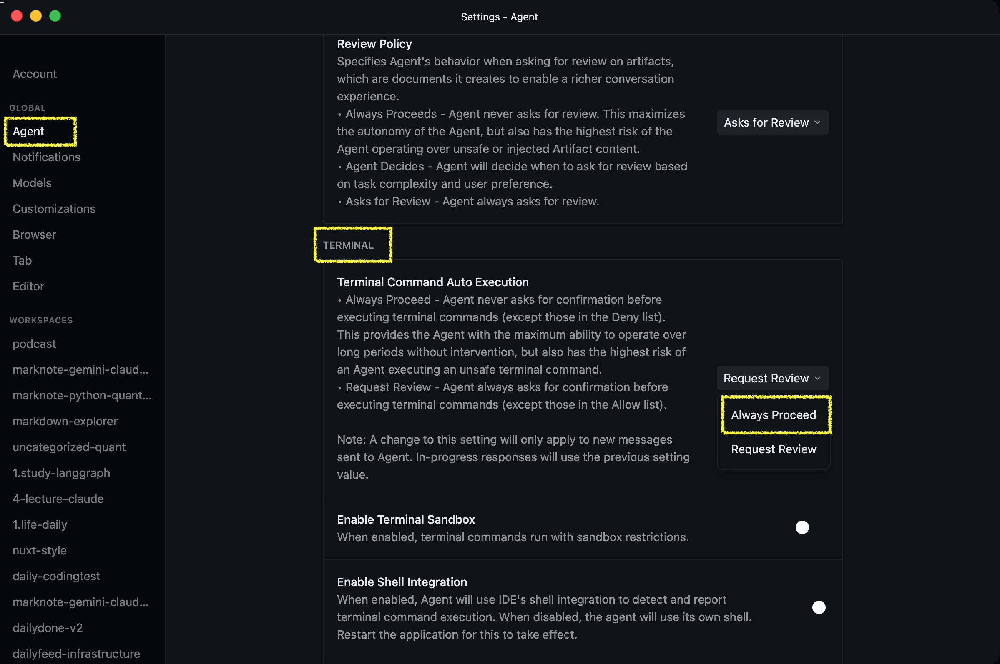

# Antigravity 소소한 팁

## (1) Antigravity Terminal Always Proceed
작업하다보면 매번 권한이 있는지 물어볼때마다 엔터키를 누르고 해야 할때가 있는데 다음옵션을 `Always Proceed` 로 누르면 Antigravity 는 질문하지 않고 계속 진행.

 

만약 주의가 필요한 작업이기에 다시 되돌려두고 명령어를 하나 하나 컨펌하면서 작업하려면 `Requeset Review` 선택

 

